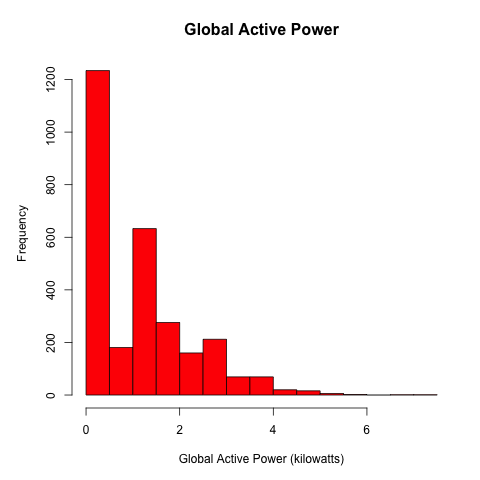
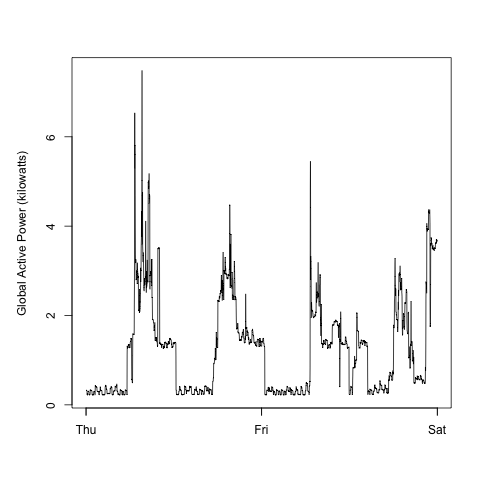
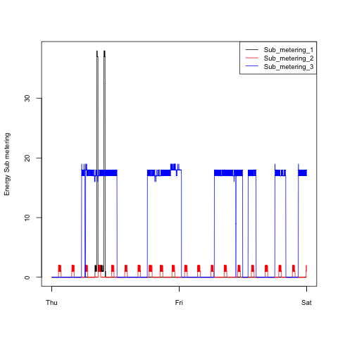
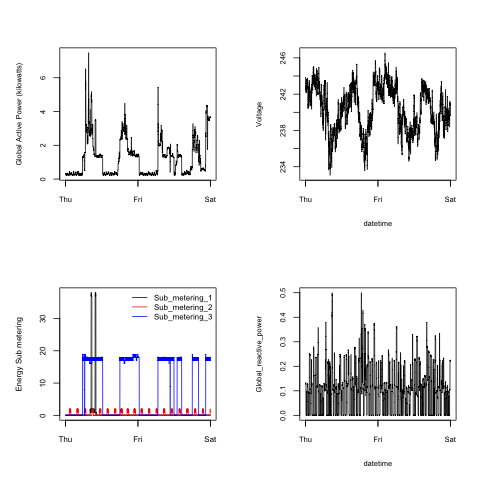

## EXData_Plotting Repo

Inside this repo you will find a set a scripts and plots for the manipulation and modeling of household electric power consumption data

## Introduction

This excersice uses the <a href="http://archive.ics.uci.edu/ml/">UC Irvine Machine
Learning Repository</a> and specifically, the "Individual household
electric power consumption Data Set". A zipped version of the dataset can be downloaded from the following URL:

* <b>Dataset</b>: <a href="https://d396qusza40orc.cloudfront.net/exdata%2Fdata%2Fhousehold_power_consumption.zip">Electric power consumption</a> [20Mb]

* <b>Description</b>: Measurements of electric power consumption in
one household with a one-minute sampling rate over a period of almost
4 years. Different electrical quantities and some sub-metering values
are available.

The following descriptions of the 9 variables in the dataset are taken
from
the <a href="https://archive.ics.uci.edu/ml/datasets/Individual+household+electric+power+consumption">UCI
web site</a>:

<ol>
<li><b>Date</b>: Date in format dd/mm/yyyy </li>
<li><b>Time</b>: time in format hh:mm:ss </li>
<li><b>Global_active_power</b>: household global minute-averaged active power (in kilowatt) </li>
<li><b>Global_reactive_power</b>: household global minute-averaged reactive power (in kilowatt) </li>
<li><b>Voltage</b>: minute-averaged voltage (in volt) </li>
<li><b>Global_intensity</b>: household global minute-averaged current intensity (in ampere) </li>
<li><b>Sub_metering_1</b>: energy sub-metering No. 1 (in watt-hour of active energy). It corresponds to the kitchen, containing mainly a dishwasher, an oven and a microwave (hot plates are not electric but gas powered). </li>
<li><b>Sub_metering_2</b>: energy sub-metering No. 2 (in watt-hour of active energy). It corresponds to the laundry room, containing a washing-machine, a tumble-drier, a refrigerator and a light. </li>
<li><b>Sub_metering_3</b>: energy sub-metering No. 3 (in watt-hour of active energy). It corresponds to an electric water-heater and an air-conditioner.</li>
</ol>

## Some more details re: the data

* The dataset has 2,075,259 rows and 9 columns. 

* This excersice only used data from the dates 2007-02-01 and
2007-02-02.

* Conversions from Date and Time characters variables to
Date/Time classes in R using the `strptime()` and `as.Date()`
functions where neccesary

* Note that in this dataset missing values are coded as `?`.

## Making Plots

The goal was to examine how household energy usage
varies over a 2-day period in February, 2007. My task was to duplicate the following 4 plots as closely to the original as was possible. To do so I followed the following steps

First I fork'd and clone'd the following GitHub repository:
[https://github.com/rdpeng/ExData_Plotting1](https://github.com/rdpeng/ExData_Plotting1)

The 4 script performs the following functions generally:

* They check to see if the user has the "household_power_consumption.txt" data set, 
or the zipped "exdata_data_household_power_consumption.zip" and if not it downloads it from the 
specified URL and unzips it

* I load in the data using load.table

* I subset the data to just the two days specifically in questions using date/time variables and which()

* Constructed one of more plots, sometimes displaying them to the screen and always saving 
them to a PNG file with a width of 480 pixels and a height of 480 pixels.

* Name each of the plot files as `plot1.png`, `plot2.png`, etc.

* Create a separate R code file (`plot1.R`, `plot2.R`, etc.) that
constructs the corresponding plot, i.e. code in `plot1.R` constructs
the `plot1.png` plot. 

The four plots that I needed to construct are shown below, and immediately below each figure
is the duplicate plot that I made

### Plot 1

 

#### Powderly Plot 1

 

### Plot 2

 

#### Powderly Plot 2

 

### Plot 3

 

#### Powderly Plot 3

 

### Plot 4

 

#### Powderly Plot 4

 
